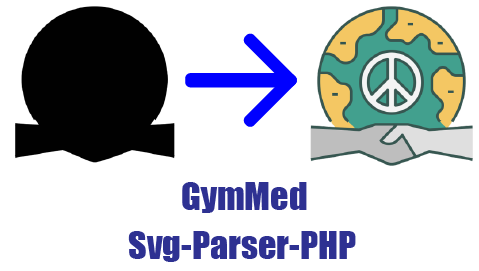

<h1 align="center">
    Svg Parser PHP
</h1>
<br/>
<div align="center">
  
</div>

Applies CSS document styles to an SVG without modifying the original SVG file.
It also parses CSS variables and inserts their values directly into CSS selectors styles, as it is intendent for broader use than just for browser rendering.

## Installation

You can install the package via composer:

```bash
composer require gymmed/svg-parser-php
```

## Use Case

[Dompdf](https://github.com/dompdf/dompdf) or laravel wrapper [laravel-dompdf](https://github.com/barryvdh/laravel-dompdf)
don't support direct SVG import or requires the inclusion of external SVG files. This library provides a way to attach CSS documents to SVG files without needing to directly modify the SVG.

If you stumble upon the same problem, I highly recommend using [imagick](https://github.com/Imagick/imagick)
or [rasterize-svg](https://github.com/choowx/rasterize-svg) to convert the SVG to PNG and include it in the PDF.
This way, you reduce the chances of the styles being rendered incorrectly by [Dompdf](https://github.com/dompdf/dompdf)
and won't need two different CSS documents or two SVG files.

## Usage

```php
use GymMed\SvgParser;

//provide full path
$svgPath = realpath(__DIR__ . "./assets/example.svg");
$cssPath = realpath(__DIR__ . "./assets/css/index.css");

$svgWithCSS = SvgParser::formatSvgFromPath($svgPath, [$cssPath]);
```

or use SVG content:

```php
use GymMed\SvgParser;

//provide full path
$svgPath = realpath(__DIR__ . "./assets/example.svg");
$cssPath = realpath(__DIR__ . "./assets/css/index.css");
$svg = file_get_contents($svgPath);

$svgWithCSS = SvgParser::formatSvg($svg, [$cssPath]);
```

If you want to write simple CSS and apply it inside SVG:

```php
use GymMed\SvgParser;

//provide full path
$svgPath = realpath(__DIR__ . "./assets/example.svg");
$svg = file_get_contents($svgPath);

$svgWithCSS = SvgParser::getParsedCSSToSvg($svg, ".circle { background-color: red; border-radius: 50% }");
```

If you want to provide only full path instead of SVG itself:

```php
use GymMed\SvgParser;

//provide full path
$svgPath = realpath(__DIR__ . "./assets/example.svg");

$svgWithCSS = SvgParser::getParsedCSSToSvgFromPath($svgPath, ".circle { background-color: red; border-radius: 50% }");
```
